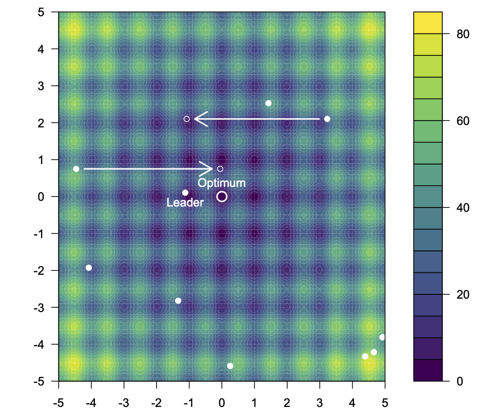
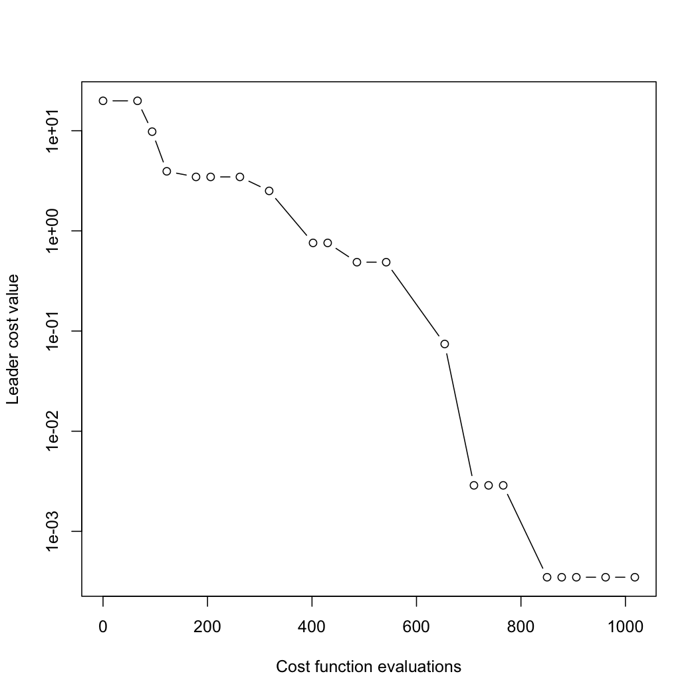

[](https://cran.r-project.org/package=soma)

# General-purpose optimisation with SOMA

The `soma` package provides an R implementation of the Self-Organising Migrating Algorithm, a general-purpose, stochastic optimisation algorithm developed originally by Ivan Zelinka.

The algorithm's approach is similar to that of genetic algorithms, although it is based on the idea of a series of "migrations" by a fixed set of individuals, rather than the development of successive generations. It can be applied to any cost-minimisation problem with a bounded parameter space, and is robust to local minima. Further details of the algorithm, and implementations for other languages, can be found at the [SOMA home page](https://ivanzelinka.eu/somaalgorithm/).



## Usage

The `soma()` function provides the R interface to the SOMA algorithm. It is called with a function to minimise, information on the minimum and maximum bounds for each parameter, and an optional list of options. The cost function must take a numeric vector of parameters as its first argument, and return a numeric scalar representing the associated cost value.

As an example, consider the two-dimensional version of [Rastrigin's function](https://en.wikipedia.org/wiki/Rastrigin_function), which has many local minima, and a global minimum of zero at (0,0).


```r
rastrigin <- function(a) 20 + a[1]^2 + a[2]^2 - 10*(cos(2*pi*a[1])+cos(2*pi*a[2]))
```

The function surface looks like this (image from Wikimedia Commons):


We can attempt to find the global minimum with the call


```r
library(soma)
r <- soma(rastrigin, bounds(min=c(-5.12,-5.12),max=c(5.12,5.12)))
## Starting SOMA optimisation
## Migration limit (20) reached - stopping
## Final leader is #2, with cost 0.000348
```

We can see in the informative output what the lowest cost function value found by the algorithm was on this run, and how it compares to the tru minimum of zero. The location in search space of the obtained minimum is


```r
print(r$population[,r$leader])
## [1] -0.0008568434  0.0010108585
```

Finally, we can plot how the optimisation progressed, showing the best cost function value at each migration:


```r
plot(r, log="y")
```



Note that there is a monotonic decrease in the cost function value of the "leader"—the individual with the lowest value—throughout.

## Options

The supported options for the default "All To One" search strategy are as follows. The defaults are as recommended in the reference below.

| Option name          | Description | Default value |
| -------------------- | ----------- | ------------- |
| `pathLength`         | The distance towards the leader that individuals may migrate. A value of 1 corresponds to the leader's position itself, and values greater than one (recommended) allow for some overshoot. | 3 |
| `stepLength`         | The granularity at which potential steps are evaluated. It is recommended that the `pathLength` not be a whole multiple of this value. | 0.11 |
| `perturbationChance` | The probability that individual parameters are changed on any given step. | 0.1 |
| `minAbsoluteSep`     | The smallest absolute difference between the maximum and minimum cost function values. If the difference falls below this minimum, the algorithm will terminate. | 0 |
| `minRelativeSep`     | The smallest relative difference between the maximum and minimum cost function values. If the difference falls below this minimum, the algorithm will terminate. | 0.001 |
| `nMigrations`        | The maximum number of migrations to complete. | 20 |
| `populationSize`     | The number of individuals in the population. It is recommended that this be somewhat larger than the number of parameters being optimised over, and it should not be less than 2. | 10 |

Two other strategies are also implemented in the package, with some differences in the options available. These can be found, along with further references, via the `?soma.options` help page within R.

## Reference

I. Zelinka (2004). *SOMA - self-organizing migrating algorithm.* In G.C. Onwubolu & B.V. Babu, eds, *New optimization techniques in engineering*. Volume 141 of "Studies in Fuzziness and Soft Computing", pp. 167-217. Springer.
